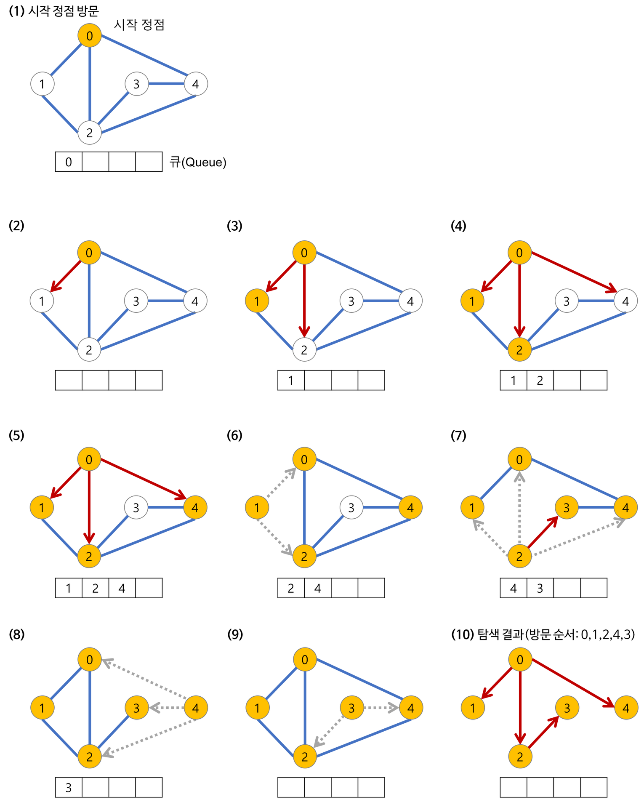

# 그래프 탐색 알고리즘

- 그래프 탐색이란 ? 하나의 정점으로부터 시작하여 차례대로 모든 정점들을 한 번씩 방문하는 것.
- 예 ) 특정 도시에서 다른 도시로 갈 수 있는 지 없는 지, 전자 회로에서 특정 단자와 단자가 서로 연결 되어있는 지

## BFS (Breadth-First Search, 너비우선탐색)

### 너비우선탐색이란 ?

- 루트노드 (혹은 다른 임의의 노드)에서 시작해서 인접한 노드를 먼저 탐색하는 방법
- 시작 정점으로부터 가까운 정점을 먼저 방문하고 멀리 떨어져있는 정점을 나중에 방문하는 순회방법이다.
- 깊게 탐색하기 전에 넓게 탐색하는 것이다.
- 두 노드 사이의 최단 경로 혹은 임의의 경로를 찾고싶을 때 사용한다.
  - 지구 상에 존재하는 모든 친구 관계를 그래프로 표현한 후 Ash와 Vanessa 사이에 존재하는 경로를 찾는 경우
  - 너비 우선 탐색의 경우 - Ash와 가까운 관계부터 탐색
  - 깊이 우선 탐색의 경우 - 모든 친구 관계를 다 살펴봐야 할 수도 있다
- 너비우선탐색이 깊이우선탐색보다 좀 더 복잡하다.

### BFS의 특징

- 직관적이지 않다.
- 재귀적으로 동작하지 않는다.
- 어떤 노드를 방문했었는지 여부를 반드시 검사해야한다. 이를 검사하지 않으면 무한루프에 빠질 수도 있다.
- 방문한 노드를 차례로 저장하고 꺼낼 수 있는 큐를 사용한다.
  - 즉, FIFO(First In First Out) 원칙으로 탐색한다.
  - 일반적으로 큐를 이용해 구현하는 것이 가장 잘 동작한다.



1. a 노드(시작 노드)를 방문한다. (방문한 노드 체크)
   1. 큐에 방문된 노드를 삽입(enqueue)한다.
   2. 초기 상태의 큐에는 시작 노드만이 저장
      1. 즉, a 노드의 이웃 노드를 모두 방문한 다음에 이웃의 이웃들을 방문한다.
2. 큐에서 꺼낸 노드과 인접한 노드들을 모두 차례로 방문한다.
   1. 큐에서 꺼낸 노드를 방문한다.
   2. 큐에서 커낸 노드과 인접한 노드들을 모두 방문한다.
      1. 인접한 노드가 없다면 큐의 앞에서 노드를 꺼낸다(dequeue).
   3. 큐에 방문된 노드를 삽입(enqueue)한다.
3. 큐가 소진될 때까지 계속한다.

### BFS의 구현

- 구현 방법
  - 자료구조 큐(Queue)를 사용
- BFS의 의사코드
  ```c
  void search(Node root) {
    Queue queue = new Queue();
    root.marked = true; // (방문한 노드 체크)
    queue.enqueue(root); // 1-1. 큐의 끝에 추가

    // 3. 큐가 소진될 때까지 계속한다.
    while (!queue.isEmpty()) {
      Node r = queue.dequeue(); // 큐의 앞에서 노드 추출
      visit(r); // 2-1. 큐에서 추출한 노드 방문
      // 2-2. 큐에서 꺼낸 노드와 인접한 노드들을 모두 차례로 방문한다.
      foreach (Node n in r.adjacent) {
        if (n.marked == false) {
          n.marked = true; // (방문한 노드 체크)
          queue.enqueue(n); // 2-3. 큐의 끝에 추가
        }
      }
    }
  }
  https://gmlwjd9405.github.io/2018/08/15/algorithm-bfs.html
  ```
- BFS 코드 (C++)
  ```cpp
  int v, e; // 정점의 개수, 간선의 개수
  vector<vector<int>> graph; // 인접 리스트
  vector<bool> isVisited; // 정점 방문 여부 저장

  void input(){
      cin >> v >> e;
      // 메모리 공간 할당 및 초기화
      graph.assign(v + 1, vector<int> (0, 0));
      isVisited.assign(v + 1, false);

      for(int i = 0; i < e; i++){
      	int s, e;
          cin >> s >> e;
          // 양방향 간선을 연결시킨다.
          graph[s].push_back(e);
          graph[e].push_back(s);
      }
  }

  void BFS(int start){
      queue<int> q;
      q.push(start);
      isVisited[start] = true;

      while(!q.empty()){
      	int cur = q.front();
          q.pop();

          cout << "방문한 노드 : " << cur << '\n';

          for(int i = 0; i < graph[cur].size(); i++){
          	int next = graph[cur][i];
              if(!isVisited[next]){
              	q.push(next);
                  isVisited[next] = true;
               }
           }
       }
  }
  ```
