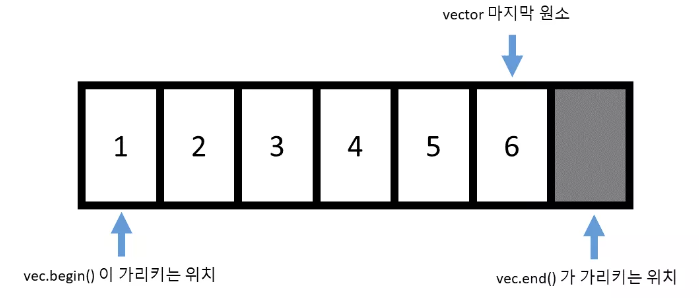

## 목차

---

1. [MAP](#1-map)
2. [반복자 iterator](#2-반복자-iterator)
3. [범위기반 for문](#3-범위-기반-for문)

<br>

## 1. MAP

---

### 1.1 MAP이란?

- map은 각 노드가 key와 value 쌍으로 이루어진 트리이다.
- 특히 중복을 허용하지 않는다.
- 따라서 map은 first, second가 있는 pair 객체로 저장되는데, first-key, second-value로 저장된다

### 1.2 MAP의 기본형태

```c
map<key, value> map1;
```

### 1.3 MAP 사용방법

1. 헤더포함
   - `#include<map>` 처리를 해주어야 한다.
2. map 선언
   - `map<key type, value type> 이름` 이다
   - 예를 들면 `map<string, int> map1;`
3. map에 찾고자 하는 데이터가 있는 지 확인한다.

   - map에서 데이터를 찾을 때는 iterator을 사용한다. 데이터를 끝까지 찾지 못한 경우, iterator은 map.end()를 반환한다.
     ```c
     	if(m.find('Alice') != m.end()){
     	cout << "find" << endl;
     } else {
     	cout << "not found" << endl;
     }
     ```

4. map에 데이터 삽입

   - map은 중복을 허용하지 않는다. insert가 수행할 때, key가 중복되면 insert가 수행되지 않는다.
   - 중복된다면 이것은 key의 역할을 제대로 하지 않는다.

   ```c
   m.insert({"Cam", 300});
   ```

5. 반복문 데이터 접근(first, second)
   - 인덱스 기반 반복문을 활용한 예제
   - 인덱스 기반은 iterator을 활용하여 begin()부터 end()까지 찾는다.
     ```c
     for(auto iter = m.begin(); iter != m.end(); iter++){
     	cout << iter->first << ' ' <<iter->second << endl;
     }
     ```
   - 범위 기반 반복문을 활용한 예제
     `c
for (auto iter : m) {
	cout << iter.first << " " << iter.second << endl;
}
`
     <br>

## 2. 반복자 iterator

---

### 2.1 반복자란?

- 컨테이너 원소에 접근할 수 있는 포인터와 같은 객체이다.
- 대부분의 알고리즘 라이브러리의 경우 대부분이 반복자를 인자로 받아서 알고리즘을 수행한다.
- 반복자는 컨테이너에 iterator 멤버 타입으로 정의 되어 있다.
- vector의 경우 반복자를 얻기 위해서 begin(), end()함수를 사용해야 하는 데, 이는 다음과 같은 위치를 리턴한다.



<br>

## 3. 범위 기반 for문

---

- C++ 11에서부터는 범위기반 for문을 이용하여 컨테이너의 원소를 간단하게 접근할 수 있다.

  ```c
  #include<iostream>
  #include<vector>

  using namespace std;

  int main() {
  	vector<int> vec;
  	vec.push_back(1);
  	vec.push_back(2);

  	for(int elem : vec) {
  		cout << "원소 : " << elem << endl;
  	}
  }
  ```

  - 위의 경우, `elem`에 `vec`의 원소들이 매 루프마다 복사되어 들어가게 된다.
  - 마치 `elem = vec[i];`를 한 것과 같다.

  ```c
    for(const auto& elem : vec){
        cout << elem << endl;
    }
  ```

- 위와 같이 `const auto&` 로 `elem`을 선언했으므로, `elem`은 `vec`의 원소들을 복사해 들어가는 것이 아닌, 상수 레퍼런스로 접근하게 된다.
