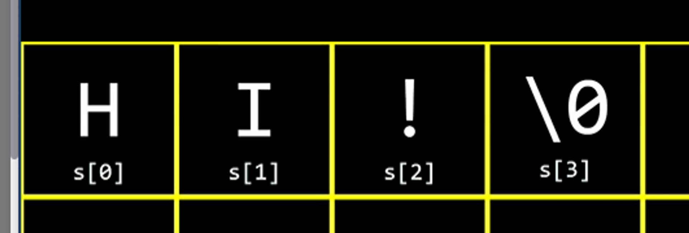

# 3. 배열

## 3.1 컴파일링

### 3.1.1 컴파일링 코드

```c
#include <stdio.h>
int main(){
	prinf("Hello World!");
}

// 컴파일시 명령어
clang -o hello hello.c
./hello
```

```c
#include <cs50.h>
#include <stdio.h>

int main() {
	string name = get_string("What's your name?\n");
	printf("Hello, %s", name);
}

// 컴파일시 명령어
clang -o hello hello.c -lcs50
./hello
```

### 3.1.2 컴파일의 4단계

```c
#include <cs50.h>
#include <stdio.h>

int main() {
	string name = get_string("What's your name?\n");
	printf("Hello, %s", name);
}

// 컴파일시 명령어
clang -o hello hello.c -lcs50
./hello
```

- preprocessing

  - #include로 가져온 라이브러리 내의 소스코드를 모두 복사해온다

  ```c
  ...
  int get_string(){...}
  ...
  int printf(){...}
  ...

  int main() {
  	string name = get_string("What's your name?\n");
  	printf("Hello, %s", name);
  }

  // 컴파일시 명령어
  clang -o hello hello.c -lcs50
  ./hello
  ```

- compile
  - 코드가 clang에 의해 컴파일 되면 c로 작성된 소스코드는 어셈블리어로 변환한다.
- assembling
  - 어셈블리 코드를 0과 1로 변경한다
- linking
  - 0과 1로 나뉜 코드를 hello.c, cs50.c, printf.c로 변경한다.

## 3.2 디버깅

### 3.2.1 버그란 ?

- 의도하지 않은 프로그램 내의 실수

## 3.6 문자열과 배열

```
#include<stdio.h>
int main(){
    string = name;


}
```



##
