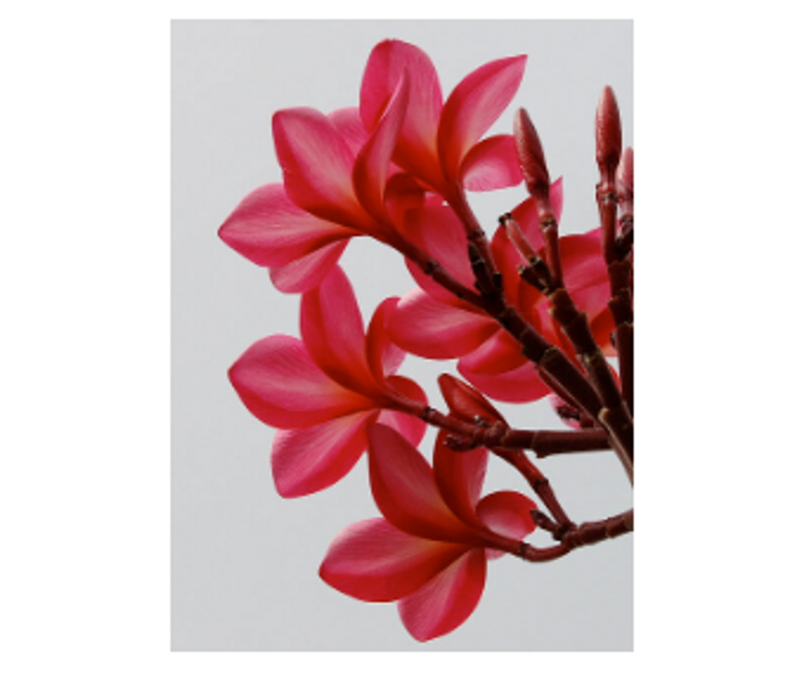
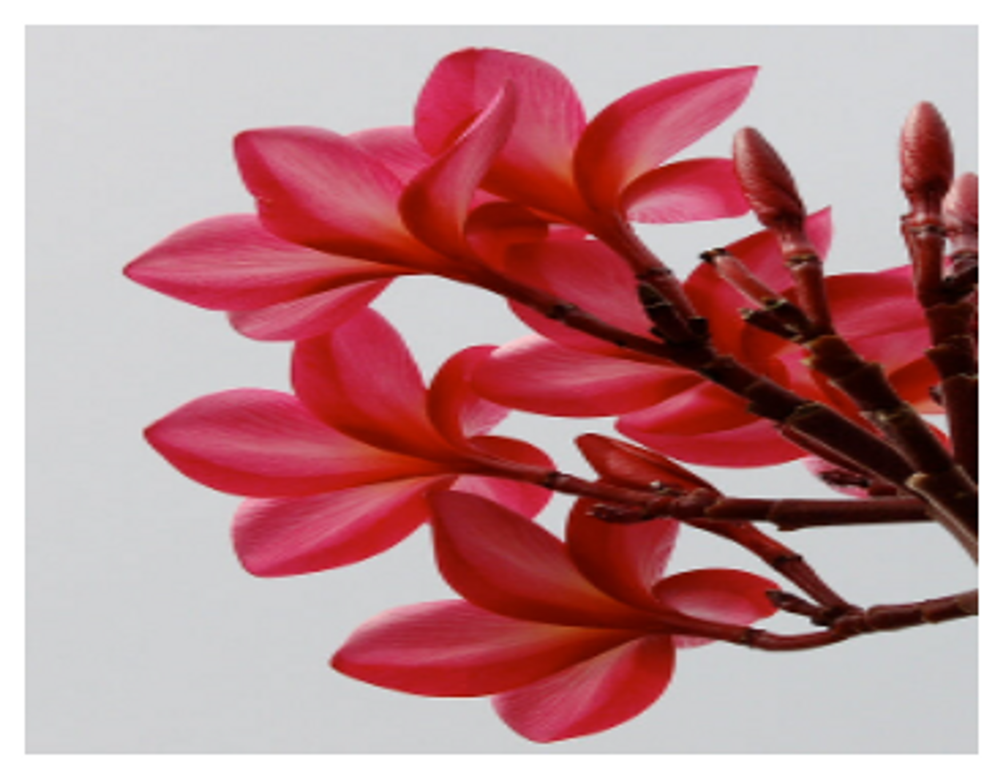
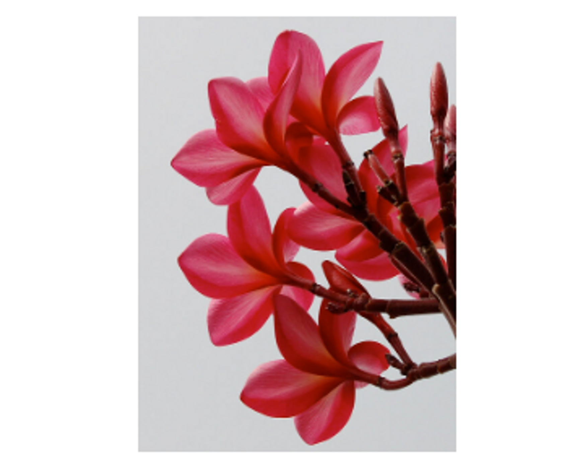
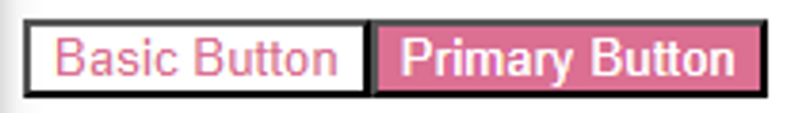
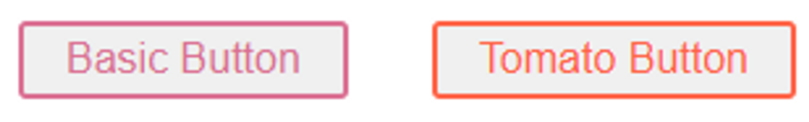

# CSS

## CSS 속성

### object-fit

- contain
  - 대체 컨텐츠의 가로세로비를 유지하면서, 요소의 컨텐츠 박스 내부에 들어가도록 맞춤 조절
    
- cover
  - 대체 컨텐츠의 가로세로비를 유지하면서, 요소 컨텐츠 박스르 가득 채운다. 서로 가로세로비가 일치하지 않으면 잘려나간다.
    
- fill
  - 요소 컨텐츠 박스 크기에 맞춰 대체 컨텐츠의 크기가 조절된다. 컨텐츠가 컨텐츠 박스를 가득 채우고, 서로 가로세로비가 일치하지 않으면 컨텐츠가 늘어난다.
    
- none
  - 대체 컨텐츠의 크기를 조절하지 않는다.
    
- scale-down
  - none, contain 중 더 작아지는 것을 선택한다.
    

## TailWind CSS

- HTML 안에서 CSS 스타일을 만들 수 있게 해주는 CSS 프레임워크이다.

### CSS 프레임워크란?

- CSS 프레임워크는 레이아웃 및 여러 컴포넌트 구성, 브라우저 호환성을 보장하는데 소요되는 시간을 최소화하기 위해 여러 웹 개발 / 디자인 프로젝트에 적용할 수 있는 CSS 파일 모음이다.
- 더 빠르게 애플리케이션을 스타일링 하는 데 도움을 준다.
- Material UI, React Bootstrap, Semantic UI, Ant Design, Materialize 등이 있다.

### Tailwind CSS의 장점

- Bootstrap과 비슷하게 m-1, flex와 같이 미리 세팅된 Utility Class를 활용하는 방식으로 HTML에서 스타일링이 가능하다.
- 따라서 빠른 스타일링 작업이 가능하다
- class 혹은 id 명을 작성하기 위한 고생을 하지 않아도 된다.
- 유틸리티 클래스가 익숙해지는 시간이 필요할 수 있지만 IntelliSense 플로그인이 제공되어 금방 익숙해질 수 있다.

### 사용법

- HTML 태그에 className = “속성 값” 으로 스타일링을 넣어주면 된다.

```jsx
<div className="flex item-center mx-1 p-1 w-full text-blue-100" />
```

## Styled-Components

스타일링 컴포넌트의 이름은 대문자로 시작해야한다.

### props 적용

```jsx
return (
	<Button>Basic Button</Button>
	<Button primary>Primary Button</Button>
)

const Button = styled.button`
	background: ${props => props.primary ? "palevioletred" : "white"};
	color: ${props => props.primary ? "white" : "palevioletred"};
`
```

- 두 번째 Primary 버튼은 props로 primary를 받았기 때문에 background는 palevioletred, color는 white가 될 것이다.



### 스타일링 상속

```jsx
return (
	<Button>Basic Button</Button>
	<TomatoButton>Tomato Button</TomatoButton>
)

const Button = styled.button`
  color: palevioletred;
  font-size: 1em;
  margin: 1em;
  padding: 0.25em 1em;
  border-radius: 3px;
  border: 2px solid palevioletred;
`;

const TomatoButton = styled(Button)`
  color: tomato;
  border-color: tomato;
`;

```



- styled(Button)을 해주게 되면 Button 값들을 상속받는다.
- 그러나 color, border-color 등 겹치는 속성 값들은 새로 설정한 값으로 덮어씌워진다.
