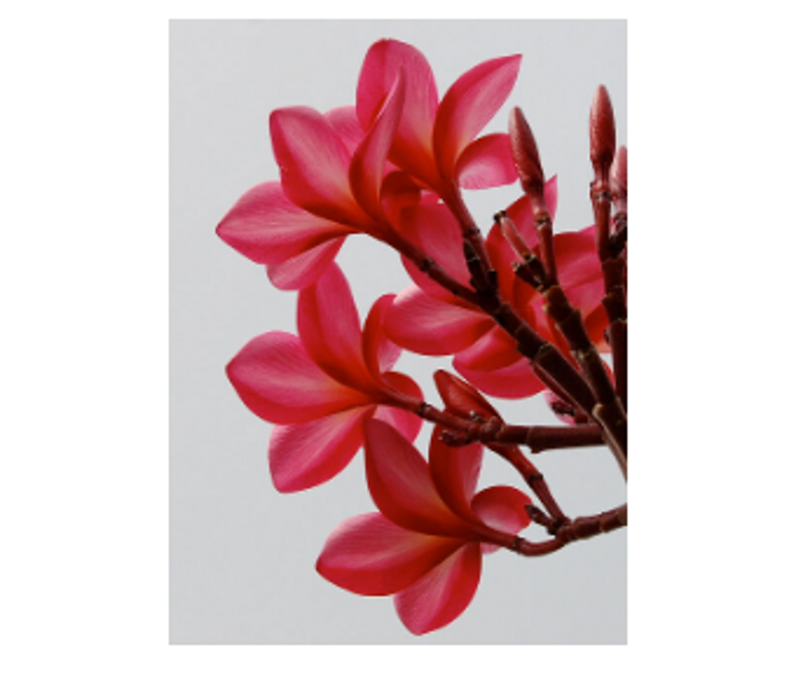
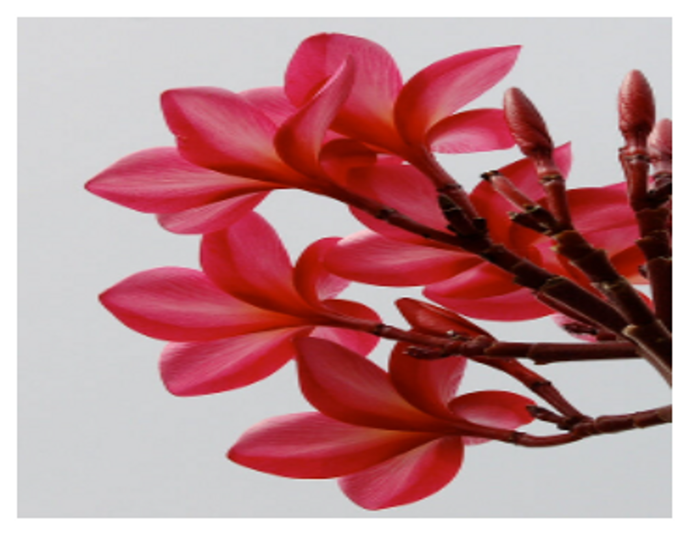
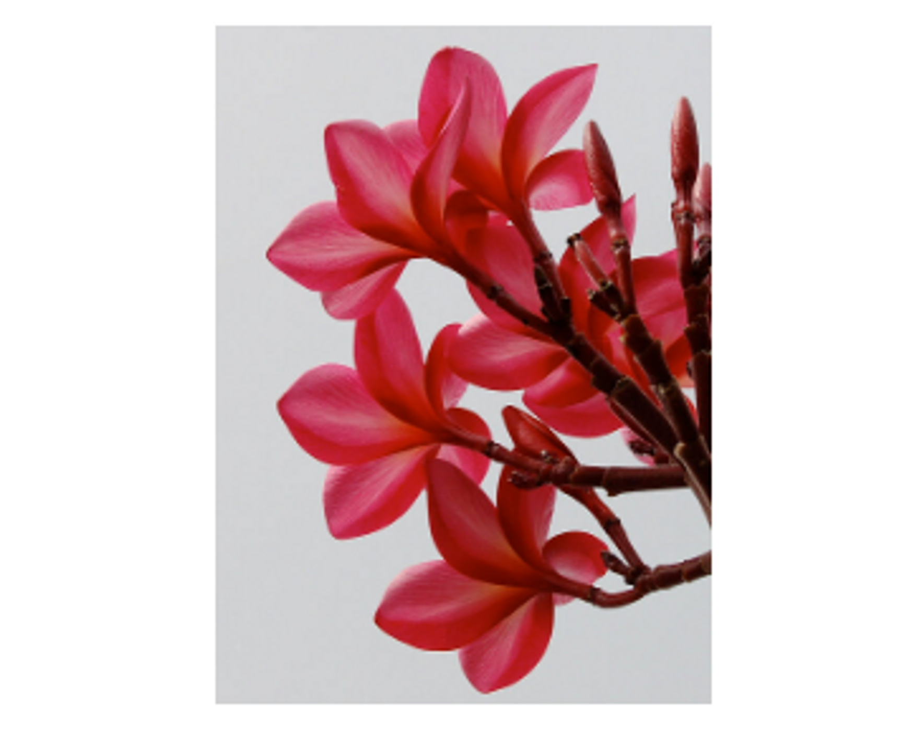

# CSS

### object-fit

- contain
  - 대체 컨텐츠의 가로세로비를 유지하면서, 요소의 컨텐츠 박스 내부에 들어가도록 맞춤 조절
    
- cover
  - 대체 컨텐츠의 가로세로비를 유지하면서, 요소 컨텐츠 박스르 가득 채운다. 서로 가로세로비가 일치하지 않으면 잘려나간다.
    
- fill
  - 요소 컨텐츠 박스 크기에 맞춰 대체 컨텐츠의 크기가 조절된다. 컨텐츠가 컨텐츠 박스를 가득 채우고, 서로 가로세로비가 일치하지 않으면 컨텐츠가 늘어난다.
    
- none
  - 대체 컨텐츠의 크기를 조절하지 않는다.
    
- scale-down
  - none, contain 중 더 작아지는 것을 선택한다.
    
