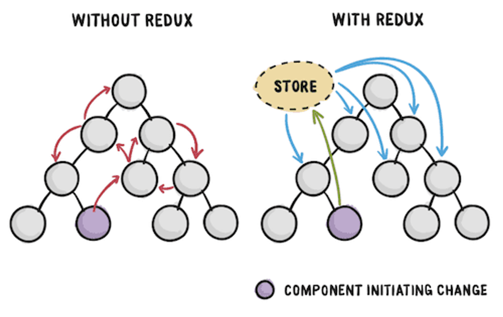

## Redux

### 리덕스란 ?

- 리덕스란, 자바스크립트 애플리케이션을 위한 상태 관리 라이브러리이다.

### Props vs State

- Props
  - Properties의 줄임말이다
  - Props는 구성요소가 서로 통신하는 방법이다.
  - Props는 상위 구성요소에서 아래쪽으로 흐른다.
  - 해당 값을 변경하려면 자식 관점에서 Props를 변경할 수 있으며, 부모 입장에서는 내부 상태를 변경해야한다.
  ```jsx
  <ChatMessage messages={message} currentMember={member} />
  ```
- State
  - 부모 컴포넌트에서 자식 컴포넌트로 데이터를 보내는 것이 아닌, 그 컴포넌트 안에서 데이터를 전달 할 때 state를 사용한다.
  - 예를 들어 검색 창에 글을 입력할 때 글이 변하는 것은 state를 바꾸는 것이다.
  - State는 바뀔 수 있다.
  - State이 바뀌면 re-render 된다.
  ```jsx
  state = {
    message: "",
    attachFile: undefined,
    openMenu: false,
  };
  ```

<aside>
💡 그래서 Redux는 state를 관리하는 것이다 !!

</aside>



- 리덕스가 없을 땐 하위 컴포넌트의 상태가 변경되려면 상위 컴포넌트까지 다 올라가서 소통하고 변경해야 했다.
- 그러나 리덕스가 있다면, Store에 있는 상태를 변경하면 알아서 하위 컴포넌트들에게도 적용할 수 있다.

### Redux Data Flow (strict unidirectional data flow)


### Action

- 간단한 JavaScript 객체이다.
- Action에는 우리가 수행하는 작업의 유형을 지정하는 ‘type’이 있으며, 선택적으로 redux 저장소에 일부 데이터를 보내는 데 사용되는 ‘payload’ 속성을 가질 수 있다.

```jsx
{type: 'LIKE_ARTICLE', articleId: 42}
{type: 'FETCH_USER_SUCCESS', response: {id: 3, name: 'Hary'}}
{type: 'ADD_TODO', text: "Read the Redux docs"}
```

### Reducer

- 리듀서는 애플리케이션 상태의 변경 사항을 결정하고, 업데이트 된 상태를 반환하는 함수이다.
- 리듀서는 인수로 조치를 취하고 store 내부의 상태를 업데이트 한다.
  ```jsx
  (previousState, action) => nextState;
  ```

```jsx
// reducer의 index.tsx
const counter = (state = 0, action: { type: string }) => {
  switch (action.type) {
    case "INCREMENT":
      return state + 1;
    case "DECREMENT":
      return state - 1;
    default:
      return state;
  }
};

export default counter;
```

### Redux Store

- Store 안에는 몇 몇의 state이 있고, 이들은 action을 통해서만 변경 가능하다.

```jsx
// App.tsx
import {createStore} from 'redux'
import counter from './reducers/index.tsx' // 위 코드

const store = createStore(counter);

ReactDOM.createRoot(document.getElementById('root')!).render(
	<React.StrictMode>
		<App
			value = {store.getState()}
			onIncrement = {()=> store.dispatch({type: "INCREMENT"})}
			onDecrement = {()=> store.dispatch({type: "DECREMENT"})}
		/>
	</React.StrictMode>
)
```

cf) App.tsx

```jsx
type Props = {};

function App({ value, onIncrement, onDecrement }: Props) {
  return (
    <div>
      Clicked : {value} times
      <button onClick={onIncrement}> + </button>
      <button onClick={onDecrement}> - </button>
    </div>
  );
}
```

### Subscribe()

- change listener을 추가한다.
- 작업이 전달 될 때마다 호출되며, 상태 트리의 일부가 잠재적으로 변경되었을 수도 있다.
- 그런 다음 getState()를 호출하여 콜백 내부의 현재 상태 트리를 읽을 수 있다.

  ```jsx
  import { createStore } from "redux";
  import counter from "./reducers/index.tsx";

  const store = createStore(counter);

  const render = () => {
    ReactDOM.createRoot(document.getElementById("root")!).render(
      <React.StrictMode>
        <App
          value={store.getState()}
          onIncrement={() => store.dispatch({ type: "INCREMENT" })}
          onDecrement={() => store.dispatch({ type: "DECREMENT" })}
        />
      </React.StrictMode>
    );
  };

  render();

  store.subscribe(render);
  ```

  렌더링 되는 부분을 render 함수로 바꿔주고, 함수를 호출한다.
  그리고 store.subscribe(render)을 통해 렌더링 되는 부분의 스토어를 구독해준다.
